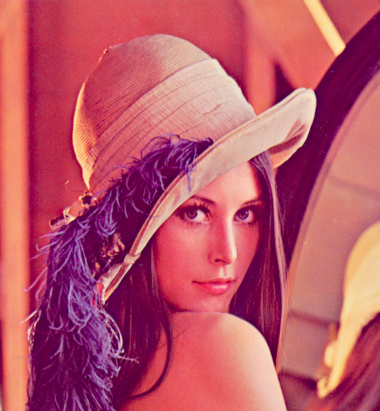
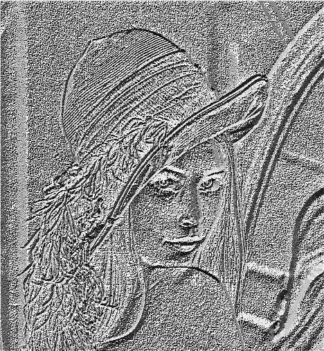
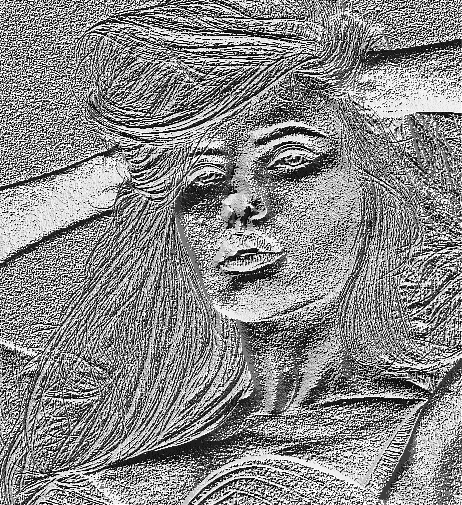
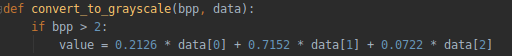
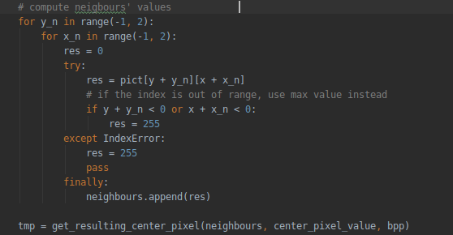
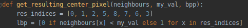

= LBP Príznaky
:toc:

== O plugine
Plug-in vytvára zo zdrojového obrázku jeho LBP histogram, je určený pre Gimp verzie 2.10. a Python verzie 3.x, OS Windows i Unix. Skript využíva výhradne natívne Python funkcie, vďaka čomu si môžme ušetriť nervy inštaláciou externých knižníc. Vstupný obrázok v ľubovoľnom farebnom móde je prevedený na čiernobiely, následne sa generuje výsledný LBP histogram, ktorý sa pridá na novú vrstvu (teda pôvodný obrázok ostane nezmenený).
Jedná sa o základnú verziu bez možosti zvolenia polomeru okolia, progres je možné sledovať na spodnej lište. 

== Inštalácia

Linux::
+ 
Plug-in je určený pre Gimp verzie 2.10. Skript stiahnite a presuňte do priečinka, ktorý má Gimp nastavený ako zdroj plug-inov (môžte to skontrolovať v menu Edit -> Preferences -> Folders -> Plug-ins, zvoľte ľubovoľný z uvedených priečinkov). Uistite sa, že skript má právo na spustenie a ak nie, pridajte mu ho príkazom _cd <plugins_dir>; chmod +x <názov_skriptu>_. 

Windows::
+ 
Rovnaký postup ako pre Linux, s výnimkou, že nie je potrebné sa starať o spustiteľnosť skriptu.

== Použitie
Po inštalácií pluginu a spustení Gimpu je skript k dispozícií v menu Image -> Create LBP histogram. Skript je možné spustiť po nahratí zdrojového obrázku. Výsledný histogram sa objaví na novej vrstve.

== Ukážky výstupu

=== RGBA
vstup:

výstup:

=== Grayscale
vstup: 

výstup:

== Technické detaily implementácie

Ako prvé skonvertujeme obrázok na čiernobiely pomocou relatívnych luma koeficientov.

Získame okolie každého pixelu. V prípade, že okolie sa nachádza mimo rozsah obrázka, je hodnota daného pixelu nahradená hodnotou 255. Ostatné metódy doplnenia krajných hodnôt
(zrkadlenie pôvodného obrázku, extrapolácia hodnôt) sú na ručnú implementáciu zbytočne komplikované a neprinesú v prípade LBP histogramu výrazne lepší výsledok. 

Využitím python list comprehension elegantne vytvoríme pole bitov výsledného centrálneho pixelu. 

Napokon, hodnotu jednoducho prevedieme do dekadicej sústavy a zapíšeme do výsledného histogramu.

== Zdroje
Inšpiráciu pre skript som čerpala z materiálov cvičení PGA, dokumentácie pre Gimp https://developer.gimp.org/index.html , oficiálnej Python dokumentácie a štruktúru dokumentu z referenčných prác. 
Zdroj foto Lenny: https://en.wikipedia.org/wiki/Lenna
Zdroj foto Scarlett: https://pixers.cz/nalepky/scarlett-johansson-PI7560
