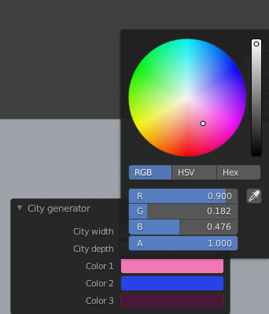

= Dokumentácia City generator
:toc: 

== Zadanie

== Popis 
City generátor je plugin do Blenderu, ktorý generuje mesto zložené z náhodne 
generovaných mrakodrapov. 
Je možné si zvoliť trojicu farieb budov, výšku a šírku mriežky mesta.
Plugin je určený pre Blender 2.81.

== Inštalácia
=== OS Windows i Unix
Stiahneme zdrojový kód pluginu ```city_generator.py```, otvoríme ho vo vstavanom Blender Scripting editore
a skript spustíme tlačidlom vpravo hore _Run Script_.

== Spustenie 

Skript nájdeme pod položkou _Add_ -> _Mesh_ -> _City generator_.


== Použitie

V tomto plugine dokážeme nastavovať nasledujúce parametre: 

- *City width* - počet budov na šírku

- *City depth* - počet budov na dĺžku

- *Color1 - Color3* - trojica farieb, použitá na zafarbenie budov (na poradí nezáleží, farby sú budovám priradzované náhodne)

image::./images/menu1.png[]



== Technická dokumentácia
Inšpirovala som sa prevažne z cvičení, odkiaľ mám základnú štruktúru kódu. Ďalej som pri tvorbe využívala oficálnu dokumentáciu k Blendru a Pythonu.

=== Základný stavebný prvok - funkcia createBlock()

Základným kameňom nášho mestečka snov je obyčajný kváder, ktorý som vytvorila ručne z vertexov a faceov. Funkcia je parametrizovaná a použiteľná pre tvorbu kvádru ľubovoľných rozmerov.
[source, python]
----
def createBlock(vertices, edges, faces, location, x_s, y_s, z_s):
    x = location[0]
    y = location[1]
    z = location[2]
    # declare length of vertices to be able to concatenate the vertices, edges and faces and create single mesh
    prev_vert = len(vertices)

    # create bottom vertices of the block
    vertices.append((x, y, z))
    vertices.append((x + x_s, y, z))
    vertices.append((x + x_s, y + y_s, z))
    vertices.append((x, y + y_s, z))
    
    # create upper vertices of the block
    vertices.append((x, y, z + z_s))
    vertices.append((x + x_s, y, z + z_s))
    vertices.append((x + x_s, y + y_s, z + z_s))
    vertices.append((x, y + y_s, z + z_s))
    
    # create the faces in correct winding
    faces.append([0 + prev_vert, 3 + prev_vert, 2 + prev_vert, 1 + prev_vert])
    faces.append([1 + prev_vert, 2 + prev_vert, 6 + prev_vert, 5 + prev_vert])
    faces.append([0 + prev_vert, 1 + prev_vert, 5 + prev_vert, 4 + prev_vert])
    faces.append([3 + prev_vert, 0 + prev_vert, 4 + prev_vert, 7 + prev_vert])
    faces.append([4 + prev_vert, 5 + prev_vert, 6 + prev_vert, 7 + prev_vert])
    faces.append([2 + prev_vert, 3 + prev_vert, 7 + prev_vert, 6 + prev_vert])
    return vertices, edges, faces
----

=== funkcia CreateBuildingPart()

Pomocou tejto funkcie generujeme celú časť budovy, podľa parametrov závisí, či sa jedná o spodnú alebo hornú časť. Stará sa o generáciu rohových piliérov, poschodí, základne a taktiež i vertikálnych rozdelení.

[source, python]
----
def createBuildingPart(vertices, edges, faces, location, size, height, pillar_sz):
    # create base
    createBlock(vertices, edges, faces, location, size, size, 0.5)

    # create pillars
    createBlock(vertices, edges, faces, location, pillar_sz, pillar_sz, height)
    createBlock(
        vertices,
        edges,
        faces,
        (location[0] + size - pillar_sz, location[1], location[2]),
        pillar_sz,
        pillar_sz,
        height,
    )
    createBlock(
        vertices,
        edges,
        faces,
        (location[0] + size - pillar_sz, location[1] + size - pillar_sz, location[2]),
        pillar_sz,
        pillar_sz,
        height,
    )
    createBlock(
        vertices,
        edges,
        faces,
        (location[0], location[1] + size - pillar_sz, location[2]),
        pillar_sz,
        pillar_sz,
        height,
    )

    # create stories
    story_height = random.randint(20, 65) / 10
    story_thickness = random.randint(5, 15) / 10
    x = location[2] + story_height

    while x + 2 < location[2] + height:
        createBlock(
            vertices,
            edges,
            faces,
            (location[0], location[1], x),
            size,
            size,
            story_thickness,
        )
        x += story_thickness + story_height

    # sometimes, if the block is wide enough, create additional vertical pillars 
    if size - 2 * pillar_sz > 3 * pillar_sz and random.randint(1, 3) == 3:
        w = size - 4 * pillar_sz
        x_locs = [location[0], location[0], location[0] + w / 3 + pillar_sz, 
                  location[0] + w / 3 * 2 + 2 * pillar_sz]
        y_locs = [location[1] + w / 3 + pillar_sz, location[1] + w / 3 * 2 + 2 * pillar_sz,
                  location[1], location[1]]
        for i in range(0, 2):
            createBlock(vertices, edges, faces,
                       (x_locs[i], y_locs[i], location[2] + 0.5),
                        size, pillar_sz, height)
       
    # create top
    createBlock(vertices, edges, faces,
               (location[0], location[1], location[2] + height),
                size, size, 0.5)

    return vertices, edges, faces
----

=== funkcia generateRoof()

Táto funkcia nám po jej zavolaní s pravdepodobnosťou 1/3 vygeneruje na našej budove strechu. Strecha má rámcovo udaný tvar, presné rozmery sú ale generované náhodne.

[source, python]
----
def generateRoof(vertices, edges, faces, location, base_size):
    has_roof = random.randint(1, 3)

    if has_roof == 1:
        height = random.randint(15, 30)
        sect_1 = height / 10
        sect_2 = sect_1 * 3
        sect_3 = sect_1 * 6

        dif1 = random.randint(10, 30) / 10
        dif2 = random.randint(10, 20) / 10 + dif1
        dif3 = base_size - dif1 - dif2 - random.randint(5, 15) / 10
        if dif3 < 0.2:
            dif3 = 1

        createBlock(
            vertices,
            edges,
            faces,
            (location[0] + dif1, location[1] + dif1, location[2]),
            base_size - 2 * dif1,
            base_size - 2 * dif1,
            sect_1,
        )
        createBlock(
            vertices,
            edges,
            faces,
            (location[0] + dif2, location[1] + dif2, location[2] + sect_1),
            base_size - 2 * dif2,
            base_size - 2 * dif2,
            sect_2,
        )
        createBlock(
            vertices,
            edges,
            faces,
            (location[0] + dif3, location[1] + dif3, location[2] + sect_2 + sect_1),
            base_size - 2 * dif3,
            base_size - 2 * dif3,
            sect_3,
        )

    return vertices, edges, faces
----

=== funkcia createBuilding()

Akonáhle máme vytvorené všetky jednotlivé stavebné prvky budovy, vo funkcií createBuilding ich dáme do jedného celku a vytvoríme tak celú budovu. Každá budova sa skladá z 2 base častí, 2 vnútorných častí (imitácia okien),
okolitého chodníka a prípadne strechy.

[source, python]
----
# create whole random building at certain location
def createBuilding(location, context, building_nbr, materials):
    vertices = []
    edges = []
    faces = []
    base_size = 20
    pillar_size = random.randint(10, 45) / 10
    base_height = random.randint(base_size, base_size * 5)
    second_base_diff = random.randint(5, 40) / 10
    second_base_height = random.randint(10, 20)

    createBuildingPart(vertices, edges, faces, location, base_size, base_height, pillar_size)
    v, e, f = createBuildingPart(
        vertices,
        edges,
        faces,
        (
            location[0] + second_base_diff,
            location[1] + second_base_diff,
            location[2] + base_height + 0.5,
        ),
        base_size - 2 * second_base_diff,
        second_base_height,
        pillar_size,
    )
    v, e, f = generateRoof(
        vertices,
        edges,
        faces,
        (
            location[0] + second_base_diff,
            location[1] + second_base_diff,
            location[2] + base_height + second_base_height,
        ),
        base_size - 2 * second_base_diff,
    )

    building_ext = create_mesh_object(context, v, e, f, "building" + str(building_nbr))
    building_ext.data.materials.append(materials[mater_index[random.randint(1, 3)]])

    vertices = []
    edges = []
    faces = []
    createBlock(
        vertices,
        edges,
        faces,
        (location[0] + 0.5, location[1] + 0.5, location[2] + 0.5),
        base_size - 1,
        base_size - 1,
        base_height + 0.5,
    )

    v1, e1, f1 = createBlock(
        vertices,
        edges,
        faces,
        (
            location[0] + 0.5 + second_base_diff,
            location[1] + 0.5 + second_base_diff,
            location[2] + 0.5 + base_height,
        ),
        base_size - 2 * second_base_diff - 1,
        base_size - 2 * second_base_diff - 1,
        second_base_height + 1,
    )
    building_int = create_mesh_object(
        context, v1, e1, f1, "building_int" + str(building_nbr)
    )
    building_int.data.materials.append(materials["black"])

    vertices = []
    edges = []
    faces = []
    v2, e2, f2 = createBlock(
        vertices,
        edges,
        faces,
        (location[0] - 2, location[1] - 2, location[2]),
        base_size + 4,
        base_size + 4,
        0.5,
    )
    pavement = create_mesh_object(context, v2, e2, f2, "pavement" + str(building_nbr))
    pavement.data.materials.append(materials["gray"])

    return building_ext
----

=== Materiály

Materiály si vytvoríme na základe vstupu užívateľa a uložíme do slovníka. Neskôr k nim môžme pristupovať priamo, alebo pomocou indexu materiálov.

[source, python]
----
def createMaterials(color_1, color_2, color_3):
    # create materials from colors chosen by user
    color1 = bpy.data.materials.new(name="color1")
    color2 = bpy.data.materials.new(name="color2")
    color3 = bpy.data.materials.new(name="color3")
    color1.diffuse_color = color_1
    color2.diffuse_color = color_2
    color3.diffuse_color = color_3

    gray = bpy.data.materials.new(name="gray")
    gray.diffuse_color = (0.05, 0.05, 0.05, 1.0)

    black = bpy.data.materials.new(name="black")
    black.diffuse_color = (0.0, 0.0, 0.0, 1.0)

    materialsDict = {
        "color1": color1,
        "color2": color2,
        "color3": color3,
        "gray": gray,
        "black": black,
    }
    return materialsDict

mater_index = {1: "color1", 2: "color2", 3: "color3"}
----

=== Hlavná trieda xCity

Základná trieda nášho pluginu, stará sa o deklaráciu panelu programu a v jej tele volá funkciu generateBuilding().

[source, python]
----
class xCity(bpy.types.Operator):
    """Create new city of your dreams!"""

    bl_idname = "object.xcity"
    bl_label = "City generator"
    bl_options = {"REGISTER", "UNDO"}

    # set number of buildings in x axis
    number_of_rows = bpy.props.IntProperty(
        name="City width", subtype="FACTOR", default=7, min=3, max=20
    )

    # set number of buildings in y axis
    number_of_cols = bpy.props.IntProperty(
        name="City depth", subtype="FACTOR", default=7, min=3, max=20
    )

    # set possible building colors
    color_1 = bpy.props.FloatVectorProperty(
        name="Color 1",
        default=(0.8, 0.8, 0.9, 1.0),
        min=0.0,
        max=1.0,
        subtype="COLOR",
        step=1,
        size=4,
    )

    color_2 = bpy.props.FloatVectorProperty(
        name="Color 2",
        default=(0.02, 0.055, 0.8, 1.0),
        min=0.0,
        max=1.0,
        subtype="COLOR",
        step=1,
        size=4,
    )

    color_3 = bpy.props.FloatVectorProperty(
        name="Color 3",
        default=(0.064, 0.01, 0.038, 1.0),
        min=0.0,
        max=1.0,
        subtype="COLOR",
        step=1,
        size=4,
    )

    def execute(self, context):
        materials = createMaterials(self.color_1, self.color_2, self.color_3)
        building_nbr = 0
        earth = createEarth(self.number_of_rows, self.number_of_cols, context)

        for i in range(0, self.number_of_rows):
            for j in range(0, self.number_of_cols):
                # create empty spot once in a while
                if random.randint(1, 20) % 5 == 0:
                    continue
                building = createBuilding((i * 35, j * 35, 3.0), context, building_nbr, materials)

        return {"FINISHED"}
----


== Ukážka použitia


image::./images/render3.png[]

== Zdroje

Vzorové práce z cvičení a ostatných študentov (predovšetkým kostra programu).
