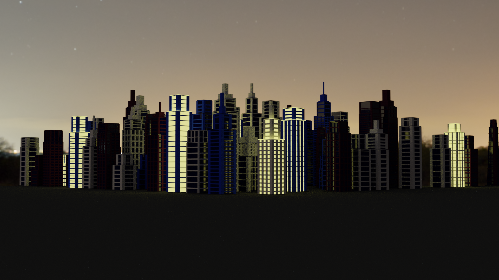

DISCLAIMER: These plugins were intended for school class, therefore I'm sorry for Czech/Slovak language of the documentation. 
Briefly, the first plugin is intended for GIMP and can be used for generating Local binary pattern from image /see https://en.wikipedia.org/wiki/Local_binary_patterns/. Second one is intended for Blender and allows user to generate random city made of skyscrapers, with ability to choose size of the city and colour palette of the buildings.

== 2D
=== LBP Příznaky
Vytvořte plug-in do GIMPu počítající a zobrazující příznaky LBP (30b)

LBP plugin počíta a zobrazuje jeho LBP príznaky pre vstupný obrázok v ľubovoľnom farebnom móde. 

image::img1.jpg[]

** xref:/2D/dokumentace1.adoc#[link na dokumentáciu]

== 3D
=== Generovanie objektov - City generator
Vytvořte plug-in do Blenderu generující parametrizovatelné objekty (10-50b)

City generator na základe zvolenej veľkosti a farieb vygeneruje mesto tvorené náhodne generovanými mrakodrapmi. 

** xref:/3D/dokumentace2.adoc#[link na dokumentáciu]
